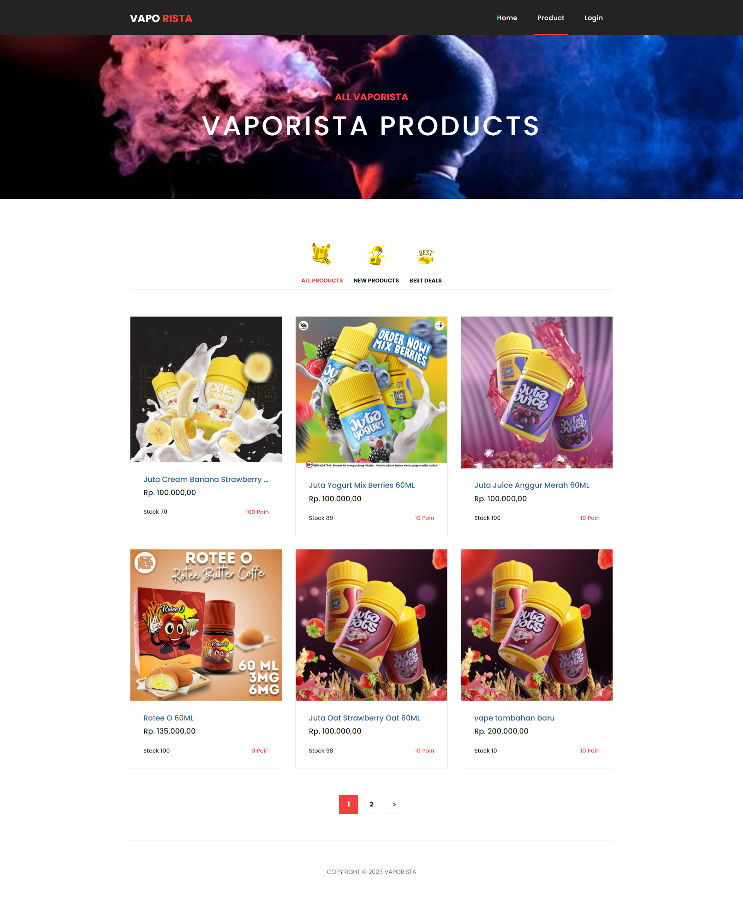
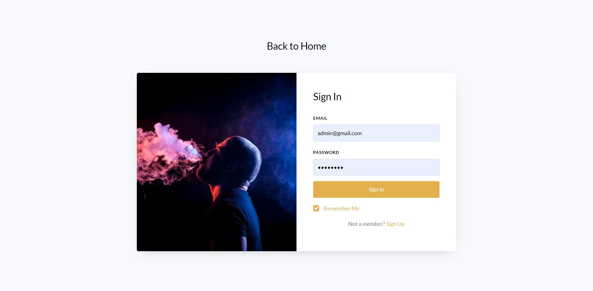

<p align="center"> </a> <a href="https://www.w3schools.com/css/" target="_blank" rel="noreferrer"></p>

<p align="center">
<a href="https://travis-ci.org/laravel/framework"></a>
<a href="https://packagist.org/packages/laravel/framework"></a>
<a href="https://packagist.org/packages/laravel/framework"></a>
<a href="https://packagist.org/packages/laravel/framework"></a>
</p>

# Sistem E-COMMERCE Produk Vapor

Website ini merupakan sebuah sistem penjualan/E-commerce dengan product-product vapor.

## Teknologi yang Digunakan
- **CodeIgniter**: Framework PHP yang handal dan mudah digunakan untuk pengembangan web, memberikan landasan yang solid untuk proyek ini.

## Instalasi

**Kloning Repositori Ini**
   ```bash
git clone https://github.com/abdulhafiztarmizi16/vaporista.git
   ```
**Buka folder tersebut di Server Lokal**
   ```bash
http://localhost/vaporista/
   ```

## Tampilan 
- Tampilan product

- Tampilan login


  


